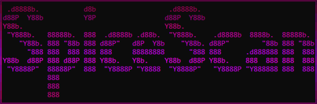

<p align="center">
  <a href="https://github.com/spicesouls/spicescan">
    
  </a>

  <p align="center">
    Fingerprinting, Port Scanning, Directory Brute Forcing, it's got it all!
    <br />
    <br />
    <a href="https://github.com/spicesouls/spicescan/issues">Report Bug</a>
    ·
    <a href="https://github.com/spicesouls/spicescan/issues">Request Feature</a>
  </p>
</p>
</p>

<p align="center">
  <a href="https://github.com/spicesouls/spicescan/stargazers"></a> <a href="https://beyondr00t.wordpress.com"></a> 
</p>
<p align="center">
  <a href="https://twitter.com/intent/tweet?text=Wow:&url=https%3A%2F%2Fgithub.com%2Fspicesouls%2Fspicescan"></a> 
</p> 


### Table of Contents
* [About](#about)
* [Guide](#guide)
  * [Installation](#installation)
  * [Arguments](#arguments)
* [Contact](#contact)

# About

**SpiceScan** is an AIO tool for server enumeration and recon, rocking features from all of your tools in one! In version 1.0, it can: Fingerprint Operating Systems, Port Scan using multiple threads, and Brute Force Directories!

# Guide

## Installation

### Unix

```
git clone https://github.com/spicesouls/spicescan

cd spicescan

pip install -r requirements.txt
```

### Windows

Download the Zip file of this resporitory, unzip it and open up cmd inside that folder then type:

```
pip install -r requirements.txt
```

## Arguments

When running **SpiceScan** in the command line, you have to supply it with arguments. If you use `python3 spicescan.py -h` you will get a list of possible arguments, which I will cover here.

### url

This is required for **SpiceScan** to scan. Simply just run spicescan but with the URL of the target after on the command line. E.g, `python3 spicescan.py targetsite.com` OR `python3 spicescan.py https://targetsite.com`

### -p

If you would like to enable port scanning, you need to also add on the `-p` flag onto your command line when running **SpiceScan**. E.g, `python3 spicescan.py targetsite.com -p`. This is turned off by default.

### -d

If you would like to enable Directory Bruteforcing, you need to, aswell as the Port Scanning flag, add on `-d` onto your command line when running **SpiceScan**. E.g, `python3 spicescan.py targetsite.com -d`. This is turned off by default.

### -t

If you would like to specify the amount of threads used, you can use the `-t` flag accompanied with your thread count on your command line when running **SpiceScan**. E.g, `python3 spicescan.py targetsite.com -t 20`. The default is 15.

### -v

If you would like more information shown to you in the terminal, then add the flag `-v` onto your command line when running **SpiceScan**. E.g, `python3 spicescan.py targetsite.com -v`. This is turned off by default.

## Contact

<p align="center">
  <a href="https://twitter.com/SpicysoulsV">Twitter</a>
  ·
  <a href="https://beyondr00t.wordpress.com">Blog</a>
  ·
  <a href="https://steamcommunity.com/id/SpiceSouls/">Steam</a>
</p>
